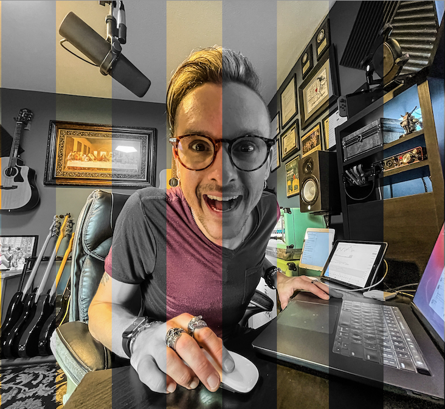

# <b>Weekend Redux Feedback Loop ➰  </b>
 

## <b>Allows a user to report their daily prime feedback</b>
 

---

#### _Duration: Two-Day Sprint_ 

 This simple application allows a student to report their daily Prime Digital Academy feedback to their instructor(s).

---
   _(this image represents the original, conceptual flow chart showing the path of information from the user's input to the Redux store as well as a backup object on the client side, both of which are used for temporary storage - the database is only utilized on user confirmation)_

 

---
---

---

### Prerequisites
---
- Internet browser application (e.g. Chrome, Safari).
 

## Installation
---
- No particular installation steps are required.
 

## Usage
---

- Page 1 - Enter a number between 1 and 10 that represents how you are generally feeling today. Click the  button to advance.
- Page 2 - Enter a number between 1 and 10 that represents how well you are understanding today's material. Click the  button to advance.
- Page 3 - Enter a number between 1 and 10 that represents how supported you feel by your staff, cohort, peers etc. Click the  button to advance.
- Page 4 - Enter any comments you may have (a response is not required). Click the  button to advance.
- Alternatively, on any pages other than Page 1, there is a  button that you can click to return to the previous page.
- Page 5 - On this page, you can  your entries and submit your feedback.
 
- On the final page, you will receive a confirmation and can click  to leave feedback again.

## Built with
---
[Visual Studio Code](https://code.visualstudio.com/)  
[Pixelmator Pro](https://www.pixelmator.com/pro/)  
[Gifox](https://gifox.io/)  
[React Spring](https://react-spring.io/)  
[Material UI](https://mui.com/)  

## License
---
N/A

 

## Acknowledgement
---
Thanks to my instructors and everyone at [Prime Digital Academy](www.primeacademy.io) for giving me the tools to do some really rad stuff. 
 

## Support
---
If you have questions or issues, please do not hesitate to email me at: [cmochinski@gmail.com](mailto:cmochinski@gmail.com). I'd love to hear from you!

---
 

_[My Twitter (@HolyMosesMusic)](https://twitter.com/holymosesmusic)_  
_[My GitHub](https://github.com/chrismochinski)_  
_[My LinkedIn](https://www.linkedin.com/in/chrismochinski/)_ 
